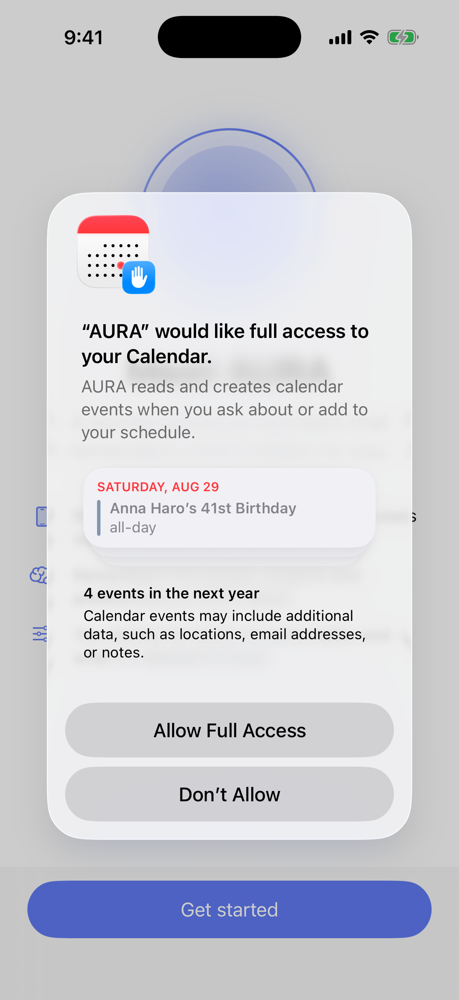
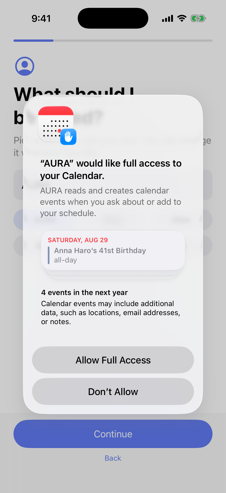
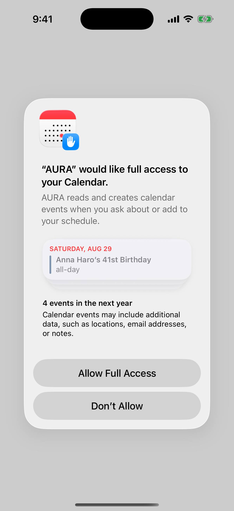
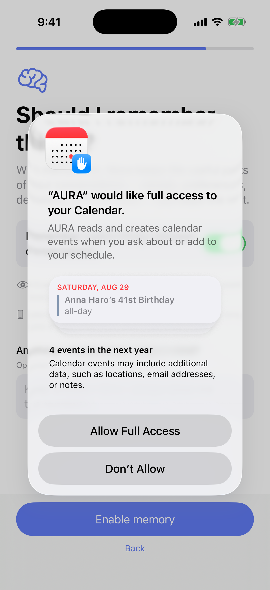
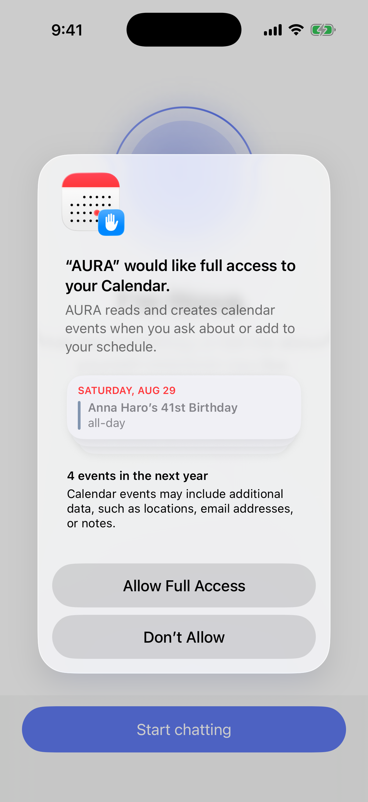
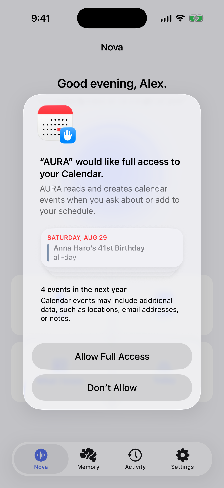
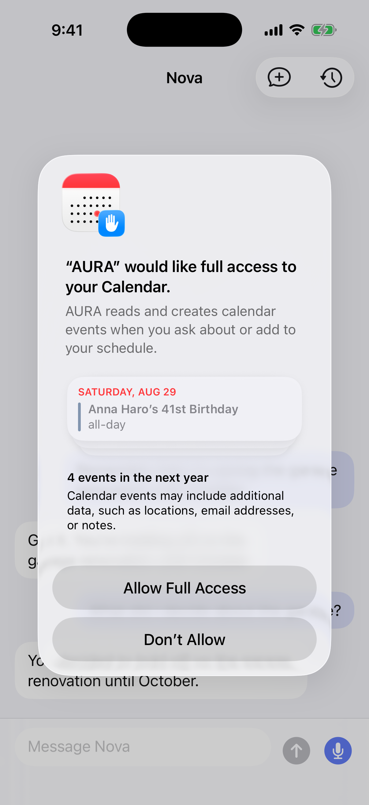
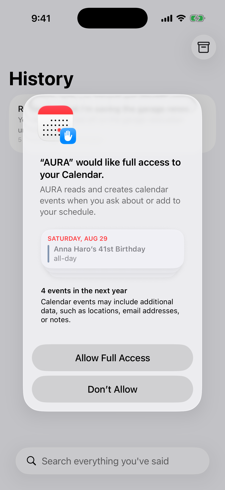

# AURA — screens

Captured automatically by `Scripts/screenshots.sh` on every CI run.
Device: **iPhone 17 Pro (6F69910C-E4FA-488A-B9C2-41B770484810)**. Status bar is pinned to 9:41 so images stay comparable between runs.

The data is seeded, using the specification's own example: the assistant is called **Nova**,
**Blake** is the user's son studying mechanical engineering at Tennessee, and the garage
renovation is on hold until October.

> The conversation screen shows a canned reply from a mock provider. A simulator has no Apple
> Intelligence, so these images cannot show the real on-device model answering.

## Light

### onboardingWelcome

### onboardingName

### onboardingPersonality

### onboardingMemory

### onboardingReady

### home

### conversation

### conversationHistory

